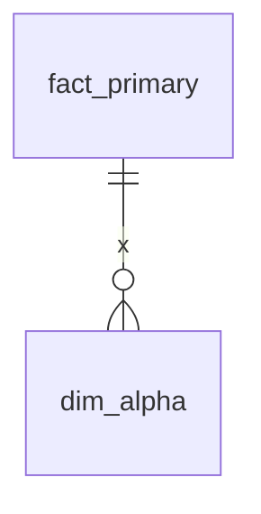

# The documentation format

The layout is the convention, and it is the only thing the tool insists on: a
domain index per directory, a document per table. Any model documented that way
is a model it can draw — a Kimball star, a snowflake, a Data Vault, a plain
third-normal-form schema, or a vocabulary of roles it has never met.

```
data-modelling/
  domain_one.md              the domain index, beside its directory
  domain_one/
    fact_primary.md          one document per table
    dim_alpha.md
  domain_two.md
  domain_two/
    dim_beta.md
```

## A table document

Five sections, each optional except `Overview` and `Columns` — a document
carrying both is what makes it a table document rather than an index:

```markdown
# fact_primary

## Overview

| Property | Value |
|---|---|
| **Table Name** | `fact_primary` |
| **Type** | Fact |
| **Domain** | Domain One |
| **Grain** | One row per thing. |
| **Update Frequency** | Daily |

Prose describing the table.

## Columns

| Column | Type | Description |
|---|---|---|
| `primary_id` | STRING | Unique id (PK) |
| `alpha_id` | STRING | User who did it |

## Column-Level Lineage

| Column | Source Table | Source Column | Notes |
|---|---|---|---|
| `primary_id` | `warehouse.upstream_model` | `id` | Primary Key |

## Relationships

| Related Table | Join Key | Relationship |
|---|---|---|
| `dim_alpha` | `alpha_id = alpha_id` | Many-to-one |

## Notes / Caveats

- Excludes cancelled rows.
```

Headings are matched case-insensitively, and by any of several spellings —
`Notes / Caveats` also answers to `Notes`.

## A domain index

An index has no `Columns` section. It is recognised by a diagram heading, a
proposed-tables heading, or — for a document at the root of the tree — a
`Description`:

````markdown
# Domain One Domain

## Description

The domain_one domain.

## Star Schema Diagram



## Lineage

| Proposed Table | Source Model(s) |
| :--- | :--- |
| `fact_primary` | `warehouse.upstream_model` |
````

The diagram heading is read generously once a document is known to be an index
— `Schema Diagram`, `Data Model Diagram`, `Entity Relationship Diagram`, `ERD`
and the star and snowflake spellings all count. A directory with table
documents but no index still forms a domain, synthesised from the directory
name, and says so as a `missing_domain_index` warning.

## Roles

A table's role comes from its `Type` property, or failing that from its name.
The vocabulary is open on purpose. These are the roles that get a name, a
family and a shape of their own:

| Family | Roles |
|---|---|
| Kimball | fact, factless fact, dimension, outrigger, bridge, junk dimension, degenerate dimension |
| Data Vault | hub, link, satellite, point-in-time |
| Relational / 3NF | entity, associative, lookup, reference |

Anything else is *not* discarded. A `Type` of `Anchor` becomes the role
`anchor`, keeps its own name through the parser, the stores and the API, and is
drawn with a shape and a colour of its own. That is what stops a model built on
a vocabulary nobody here anticipated rendering as a canvas of identical circles.
A `Type` holding a whole sentence is prose in the wrong column, and does become
`unknown`.

Roles matter to the drawing and to two diagnostics. They matter to nothing else:
relationships are resolved from cardinality and column names alone, which is why
a snowflake's dimension-to-dimension joins and a Data Vault's link-to-hub joins
need no special case anywhere in the resolver.

## Conformed dimensions

A dimension documented in more than one domain is a conformed dimension, and so
is one whose `Domain` or `Type` cell declares it — the way a shared kernel
writes `Shared Kernel (Conformed Dimensions)`. Both are flagged, both are drawn
with the conformed marker, and where several instances of one name exist the
declared one is the authority the cross-domain references bind to.

When those instances have drifted apart, that is a
[`conformed_drift`](diagnostics.md) warning rather than a silent choice.

## What the resolver does with all this

Three things that are more work than they sound, and worth knowing about
because they change what you see:

- A relationship declared from both sides (`fact_primary → dim_alpha` as
  *Many-to-one*, and `dim_alpha → fact_primary` as *One-to-many*) is a single
  edge, not two. Declarations are normalised to point from the many side to the
  one side and deduplicated.
- Join keys are matched against the tables' real column lists rather than
  trusting the order they were written in. Some documents write the *fact's*
  column first even on their own `One-to-many` rows — reversing those silently
  would have pointed `dim_beta.beta_id → fact_primary.beta_id_2` the wrong way.
- Source references are canonicalised before the lineage graph is built.
  Documents cite the same model both ways — `warehouse.upstream_model` in one
  file, `upstream_model` in another — and left unfolded that becomes two
  unrelated nodes, so "what else reads this?" quietly returns the wrong answer.

The [resolution notes](../tech/design/resolution.md) go through the rules in
full.
